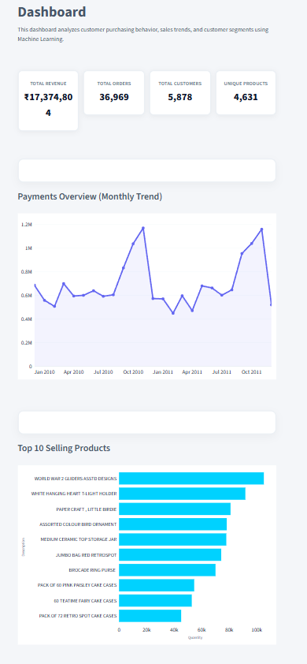

# 🛒 E-Commerce Customer Insights Dashboard

## Project Overview

E-Commerce Customer Insights is a data analytics and machine learning project that analyzes customer purchasing behavior, sales trends, and customer segments.

This project performs data cleaning, exploratory data analysis, customer segmentation, and provides an interactive dashboard using Streamlit.

## Objectives

- Analyze customer purchasing patterns
- Identify sales trends
- Find top-selling products
- Understand customer behavior
- Segment customers using Machine Learning
- Build an interactive dashboard

## Dataset

Dataset Used:
Online Retail II Dataset

Features:
- Invoice Number
- Product Description
- Quantity
- Invoice Date
- Price
- Customer ID
- Country

## Technologies Used

Programming Language:
- Python

Libraries:
- Pandas
- NumPy
- Matplotlib
- Scikit-learn
- Streamlit
- Openpyxl

Tools:
- VS Code
- GitHub

## Project Workflow

### Data Collection
Imported online retail transaction data.

### Data Cleaning
Performed:
- Handling missing values
- Removing invalid records
- Converting data types
- Creating Revenue feature

### Exploratory Data Analysis
Analyzed:
- Monthly revenue trends
- Top-selling products
- Customer purchasing behavior

### Machine Learning

Used:
- K-Means Clustering

Customer purchasing patterns are used to create customer segments.

### Dashboard Development

Built an interactive Streamlit dashboard showing:
- Total Revenue
- Total Orders
- Total Customers
- Total Products
- Sales Trends
- Customer Segmentation

## Project Structure

Ecommerce-Customer-Insights

├── data  
├── dashboard  
│   └── app.py  
├── notebooks  
├── src  
├── assets  
├── requirements.txt  
└── README.md  

## How to Run

Install dependencies:

pip install -r requirements.txt

Run dashboard:

python -m streamlit run dashboard/app.py

## Dashboard Preview

## Results

The project provides insights into customer behavior and helps businesses make data-driven decisions.

The dashboard helps analyze sales performance, product trends, and customer groups.

## Author

E-Commerce Customer Insights Project